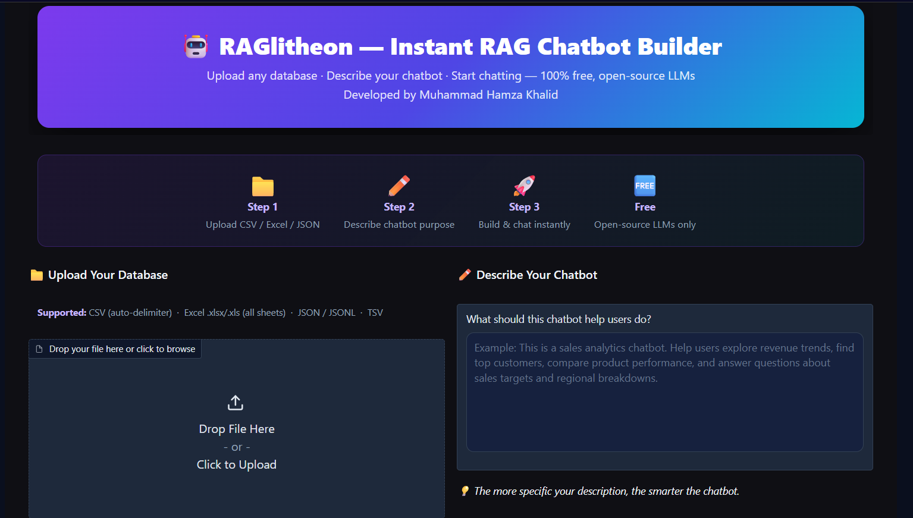

# 🤖 RAGlitheon — Instant RAG Chatbot Builder

<div align="center">


**Upload any database file → describe your chatbot's purpose → start chatting with your data instantly.**

No paid APIs. No complex setup. 100% open-source, free-tier LLMs.

[🤗 Live Demo on HuggingFace Spaces](https://huggingface.co/spaces/mhamzakhalid22/RAGlitheon) · [Report a Bug](../../issues) · [Request a Feature](../../issues)

</div>

---

## 📸 Preview

> Upload a file, describe your use case, and get a fully functional AI chatbot over your data in under 2 minutes.



---

## ✨ Features

| Feature | Details |
|---|---|
| **Universal Data Loader** | CSV, TSV, Excel (all sheets), JSON, JSONL — automatic encoding detection + separator sniffing |
| **Intelligent Chunking** | Auto-selects `row_window`, `column_group`, or `hybrid` strategy based on table shape |
| **Hybrid Search** | FAISS dense retrieval + TinyBM25 keyword search → RRF fusion → MMR diversification |
| **Free LLMs** | Mistral-7B → Qwen-2.5-7B → Llama-3.2-3B → Phi-3.5 (auto-fallback chain) |
| **Streaming** | Word-by-word token streaming for a responsive chat feel |
| **Conversation Memory** | 8-turn sliding context window |
| **Example Questions** | AI-generated starter questions tailored to your specific dataset |
| **Zero Config** | Drop in a file, describe your chatbot — everything else is automatic |

---

## 🧠 Architecture

```
File + Description
      ↓
Data Loader
(chardet encoding detection · separator sniffing · multi-sheet Excel · JSON/JSONL)
      ↓
Intelligent Chunker
(auto strategy: row_window / column_group / hybrid)
      ↓
Embedder — sentence-transformers/all-MiniLM-L6-v2
+ FAISS IndexFlatIP (cosine similarity)
      ↓
HybridRetriever
TinyBM25 (keyword) + FAISS (semantic) → RRF Fusion → MMR Diversification
      ↓
RAGPipeline
Query classifier (analytical / lookup / conversational)
+ Dynamic system prompt + 8-turn sliding memory
      ↓
LLM — HuggingFace Inference API (free tier)
Mistral-7B → Qwen-2.5-7B → Llama-3.2-3B → Phi-3.5 (fallback chain)
      ↓
Gradio 5 Chat UI
(type="messages" · streaming · example question buttons)
```

---

## 📁 Project Structure

```
RAGlitheon/
├── app.py              # Single-file deployment (all modules inlined — for HF Spaces)
│
├── data_loader.py      # Universal file loader (CSV, Excel, JSON, JSONL)
├── chunker.py          # Intelligent chunking strategies
├── embedder.py         # MiniLM embedder + FAISS index builder
├── retriever.py        # Hybrid BM25 + FAISS retriever with RRF + MMR
├── llm_client.py       # HuggingFace InferenceClient with fallback chain
├── rag_pipeline.py     # Full RAG orchestration (query → retrieve → generate)
├── __init__.py         # Package exports
│
├── custom.css          # Gradio UI theme
├── requirements.txt    # Python dependencies
└── README.md           # This file
```

> **Note:** `app.py` is a fully self-contained single-file version of the entire pipeline, designed for one-file HuggingFace Spaces deployment. The individual `.py` modules are the modular source for local development and extension.

---

## 🚀 Getting Started

### Option A — Run Locally

**1. Clone the repo**
```bash
git clone https://github.com/YOUR_USERNAME/RAGlitheon.git
cd RAGlitheon
```

**2. Install dependencies**
```bash
pip install gradio==5.14.0 pandas openpyxl xlrd chardet faiss-cpu numpy sentence-transformers "huggingface_hub>=0.24.0"
```

**3. Set your HuggingFace token**

Get a free token at [huggingface.co/settings/tokens](https://huggingface.co/settings/tokens) (Read access is enough).

```bash
# Linux / macOS
export HF_TOKEN=hf_your_token_here

# Windows CMD
set HF_TOKEN=hf_your_token_here

# Windows PowerShell
$env:HF_TOKEN="hf_your_token_here"
```

**4. Launch**
```bash
python app.py
```

Then open `http://localhost:7860` in your browser.

---

### Option B — Deploy to HuggingFace Spaces (Free)

1. Go to [huggingface.co/new-space](https://huggingface.co/new-space)
2. Choose **Gradio** SDK, SDK version `5.14.0`
3. Upload only these three files:
   ```
   app.py
   requirements.txt
   README.md
   ```
4. Go to **Settings → Repository Secrets** and add:
   ```
   Name:  HF_TOKEN
   Value: hf_your_token_here
   ```
5. The Space will build and launch automatically.

---

## 📊 Supported File Formats

| Format | Details |
|---|---|
| `.csv` | Auto-detects separator (`,` `;` `\|` `\t`) and encoding |
| `.tsv` | Tab-separated, full encoding detection |
| `.xlsx` / `.xls` | All sheets loaded as separate tables |
| `.json` | Arrays, dict-of-lists, nested `data`/`records`/`results` keys |
| `.jsonl` | One JSON object per line |
| `.txt` | Treated as CSV with separator sniffing |

---

## 🔧 Chunking Strategies

RAGlitheon automatically picks the best strategy based on your table's shape:

| Strategy | When Used | How It Works |
|---|---|---|
| `row_window` | Tall tables (many rows, few columns) | Sliding window of rows with overlap |
| `column_group` | Wide tables (30+ columns) | Groups related columns, samples rows |
| `hybrid` | Very large + wide tables | Row windows × column groups combined |

You can also manually override the strategy in the **Advanced Settings** panel in the UI.

---

## 🤖 LLM Fallback Chain

RAGlitheon uses the HuggingFace Inference API (free tier) with automatic fallbacks:

```
1. mistralai/Mistral-7B-Instruct-v0.3   ← primary
2. Qwen/Qwen2.5-7B-Instruct             ← fallback 1
3. meta-llama/Llama-3.2-3B-Instruct     ← fallback 2
4. microsoft/Phi-3.5-mini-instruct       ← fallback 3
```

If a model is rate-limited or unavailable, the pipeline automatically retries with the next one — no interruption to the user.

---

## ⚙️ Configuration

All tuneable constants live at the top of `llm_client.py` (or the `⑤ LLM CLIENT` section of `app.py`):

```python
PRIMARY_MODEL   = "mistralai/Mistral-7B-Instruct-v0.3"
FALLBACK_MODELS = [...]

DEFAULT_LLM_PARAMS = {
    "max_tokens": 1024,
    "temperature": 0.3,   # lower = more factual
    "top_p": 0.92,
}
```

Retrieval settings in `rag_pipeline.py`:
```python
top_k = 8   # chunks retrieved for analytical queries
top_k = 6   # chunks retrieved for lookup queries
```

---

## 🛠️ Tech Stack

| Component | Library |
|---|---|
| UI | [Gradio 5](https://gradio.app/) |
| Embeddings | [sentence-transformers](https://www.sbert.net/) — `all-MiniLM-L6-v2` |
| Vector Search | [FAISS](https://github.com/facebookresearch/faiss) — `IndexFlatIP` |
| Keyword Search | TinyBM25 — pure Python, zero extra deps |
| LLM Inference | [HuggingFace Hub](https://huggingface.co/docs/huggingface_hub/) — `InferenceClient` |
| Data Loading | [pandas](https://pandas.pydata.org/), [chardet](https://github.com/chardet/chardet), openpyxl, xlrd |

---

## 🐛 Common Issues

**`HF_TOKEN not set` error on chat**
→ You haven't set the environment variable. See [Getting Started](#-getting-started) above.

**`model_not_supported` error**
→ The model was dropped from HF's free Inference API. Update `PRIMARY_MODEL` in `app.py` to a currently supported model. Check if a model is live at its HuggingFace page — look for the **Inference API** widget on the right side.

**File loads but chatbot gives wrong answers**
→ Try a more specific chatbot description. The description directly shapes the system prompt and retrieval quality.

**Slow first response**
→ Normal — the embedding model (`all-MiniLM-L6-v2`, ~80 MB) loads on first use. Subsequent queries are fast.

---

## 📄 License

Licensed under the [Apache 2.0 License](LICENSE).

---

## 🙏 Acknowledgements

- [HuggingFace](https://huggingface.co/) for free model hosting and inference
- [Gradio](https://gradio.app/) for the UI framework
- [FAISS](https://github.com/facebookresearch/faiss) by Meta AI for vector search
- [sentence-transformers](https://www.sbert.net/) for the embedding model

---

<div align="center">
Made with ❤️ · If you find this useful, please ⭐ the repo!
</div>
